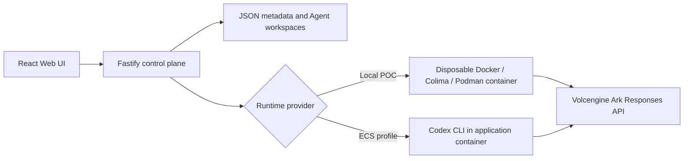

# Warden Officer

> Agents get a temporary key and a locked door instead of your production
> credential and the open internet.

Built on the CodeJam Agent Launchpad starter kit. The starter kit hands every
disposable Runtime container two things, in `apps/server/src/container-codex-runner.ts`:

```ts
"--network", "bridge",     // unrestricted outbound internet
"--env", "ARK_API_KEY",    // the real provider credential
```

That container runs model-authored code. **Warden Officer** replaces both with a
run-scoped capability: the Runtime holds only a short-lived `wgt_` grant, has no
direct Internet route, and every request it makes is authorised at a trusted
broker that a human controls and the Agent cannot reach.

## Quick start — the verified Warden path

Requires Node.js 22+, npm 10+, Docker, and your own ModelArk key and endpoint.
The repository intentionally contains neither.

```bash
git clone <this-repo> && cd CodeJam
ARK_API_KEY=<ark model api key> \
ARK_MODEL=ep-<endpoint id> \
ARK_BASE_URL=https://ark.ap-southeast.bytepluses.com/api/v3 \
npm run poc
```

Open <http://localhost:3000>. The Warden rail on the right should show a broker
address rather than "The egress broker is off." Create an Agent and send a task.

`ARK_BASE_URL` matters: the starter default points at Volcengine
(`ark.cn-beijing.volces.com`). A **BytePlus** key sent there returns
"The API key doesn't exist". Use the line above for BytePlus accounts.

| Startup path | Warden | Use |
| --- | --- | --- |
| `npm run poc` | **Enabled** | **Official judging and demo path** |
| `npm run dev` | Disabled | Baseline development only |
| `docker compose up` | Disabled | Baseline deployment only |
| ECS | Disabled | Not supported by this Warden POC |

Warden requires `RUNTIME_PROVIDER=container`; the other paths use the
local-process Runtime, which shares the host network and cannot satisfy its
isolation invariant. `WARDEN_ENABLED=auto` (the default) enables it exactly
where it can hold.

## Reproduce the demonstration

```bash
npm run warden:demo:prepare -- --agent "Warden Demo Agent"
```

Then follow **[docs/DEMO.md](docs/DEMO.md)** — a timed three-minute script
covering the normal Run, a denied exfiltration attempt at two layers, the
credential proof, and revocation with recovery.

## What Warden changes

| | Starter kit | With Warden |
| --- | --- | --- |
| Runtime credential | real `ARK_API_KEY` | short-lived `wgt_` grant |
| Runtime egress | `--network bridge`, unrestricted | internal network, broker is the only route |
| Provider surface | entire API | inference paths only |
| Cost control | none | model-call, wall-clock and token budgets |
| Mid-run control | none | revoke authority, tear down live tunnels, cancel the Run |
| Evidence | none | correlated per-Run trace, redacted at write |

The Runtime receives only a temporary `wgt_` grant. The trusted Warden broker
holds the provider credential, enforces destination and budget policy, records
correlated evidence, and can revoke the exact active Run.

## Architecture

<p align="center">
  <a href="docs/WARDEN_ARCHITECTURE.md">
    
  </a>
</p>

The standalone **[one-page Warden architecture](docs/WARDEN_ARCHITECTURE.md)**
labels the trust boundary, enforcement point, evidence path and recovery
control. Design rationale and the extension seams used are in
**[docs/WARDEN.md](docs/WARDEN.md)**.

## Verification

```bash
npm run check                                            # unit tests + build
npm run warden:smoke                                     # broker, no Docker needed
WARDEN_DOCKER_TESTS=1 npm run test -w @launchpad/server   # real two-network topology
```

The Docker suite boots the real broker, both networks and a fake upstream, then
drives them from a container on the internal network. CI runs all three plus
full-history secret scanning.

To prove the credential boundary without displaying a secret, start a long
Agent turn and run `npm run warden:secret-proof` in a second terminal. It checks
the live broker, Runtime, public grants, traces, Runs and messages, and prints
only PASS/FAIL evidence.

## Limitations

Warden is destination control, not data-loss prevention, and these are stated in
full in [docs/WARDEN.md](docs/WARDEN.md):

- TLS is not inspected on the network plane; enforcement is host and port.
- The provider key is **moved into a trusted broker, not eliminated**.
- Containers on the same internal network can still reach each other.
- Grants are in-memory and do not survive a broker restart.
- Identity is a mock principal; the point is server-side authorisation, not login.
- Docker is the supported engine; Podman and Colima are untested for the broker.

## Credentials and secret safety

Reviewers supply their own ModelArk API key and Responses-compatible endpoint;
the repository intentionally contains neither. A BytePlus key must be paired
with the BytePlus `ARK_BASE_URL` shown above. A Volcengine key must use its
matching regional Volcengine URL instead.

The provider key never enters an Agent Runtime, never appears in container
arguments, and is redacted from traces, run errors and API responses. CI scans
the full Git history with gitleaks. See [SECURITY.md](SECURITY.md) and
`npm run warden:secret-proof`.

## Documentation

| Deliverable | Here | Detail |
| --- | --- | --- |
| Setup instructions | Quick start | [docs/LOCAL_POC.md](docs/LOCAL_POC.md) |
| Middleware problem and rationale | Top of this file | [docs/WARDEN.md](docs/WARDEN.md) |
| Design summary | What Warden changes | [docs/WARDEN_ARCHITECTURE.md](docs/WARDEN_ARCHITECTURE.md) |
| One-page architecture | Architecture | [docs/WARDEN_ARCHITECTURE.md](docs/WARDEN_ARCHITECTURE.md) |
| Demo steps | Reproduce the demonstration | [docs/DEMO.md](docs/DEMO.md) |
| Automated tests | Verification | [docs/WARDEN.md](docs/WARDEN.md) |
| Limitations | Limitations | [docs/WARDEN.md](docs/WARDEN.md), [SECURITY.md](SECURITY.md) |
| No secrets | Credentials and secret safety | [SECURITY.md](SECURITY.md) |


---

# Starter platform reference

Everything below documents the unmodified CodeJam starter kit.

## Screenshots

### Agent Playground


### Create an Agent


## Features

- React and TypeScript Web UI
- Agent create, edit, start, stop, delete, and multi-turn chat
- Fastify control plane with asynchronous Run state
- Persistent Agent workspaces and Codex sessions
- Disposable Docker, Colima, or Podman container for each local turn
- Docker and Terraform deployment paths for Volcengine ECS
- Warden run grants, destination policy, revocation, budgets and redacted traces

## Requirements

- Node.js 22+
- npm 10+
- Docker for the verified Warden path; Colima or Podman for the starter baseline
- A BytePlus ModelArk API key and endpoint that supports the Responses API

Codex CLI is included in the Runtime image and is not required on the host.

## Local browser SOP

### 1. Check the local tools

Install Node.js 22+ and Docker for the supported Warden judging path, then
verify them:

```bash
node --version
npm --version
docker --version        # Docker Desktop or Docker Engine
```

Codex CLI is already included in the Runtime image.

### 2. Clone the repository

```bash
git clone https://github.com/javierchanj/techjam-agent-middleware.git
cd techjam-agent-middleware
```

Skip this step when already working from the repository root.

### 3. Start the POC

```bash
ARK_API_KEY=your-ark-api-key \
ARK_MODEL=ep-your-endpoint-id \
ARK_BASE_URL=https://ark.ap-southeast.bytepluses.com/api/v3 \
npm run poc
```

The first run installs Node.js dependencies and builds the Runtime image. The
script can select Docker, Colima, or Podman, but Docker is the verified Warden
path. Use the endpoint URL that matches the account which issued the key.

### 4. Open the browser

Visit <http://localhost:3000>, or open it from the terminal:

```bash
open http://localhost:3000       # macOS
xdg-open http://localhost:3000   # Linux desktop
```

In the Web UI:

1. Select **Create Agent**.
2. Enter a name, description, and workspace instructions.
3. Select **Create Agent** again.
4. Enter a task in the Playground, for example:

   ```text
   Create a TypeScript hello-world CLI, add a test, and run it.
   ```

The Agent can write files, run commands, and continue the same Codex session in
later messages.

### 5. Stop and resume

Press `Ctrl+C` in the startup terminal. The script removes temporary Runtime
containers but keeps Agent workspaces and conversations.

- macOS state: `~/.volc-agent-launchpad/`
- Linux state: `.local/`
- Custom location: set `LOCAL_POC_DATA_ROOT`

Run the same `npm run poc` command to continue later.

### Select a specific container engine

Force Podman when multiple engines are installed:

```bash
CONTAINER_ENGINE=podman \
ARK_API_KEY=your-ark-api-key \
ARK_MODEL=ep-your-endpoint-id \
ARK_BASE_URL=https://ark.ap-southeast.bytepluses.com/api/v3 \
npm run poc
```

Colima uses `CONTAINER_ENGINE=docker` because it exposes the Docker CLI.

For a clean Linux host, follow the
[rootless Podman setup](docs/LOCAL_POC.md#rootless-podman-on-linux).

## Docker Compose

Create and edit the configuration:

```bash
./scripts/bootstrap-local.sh
```

Required values in `.env`:

```dotenv
ARK_API_KEY=your-ark-api-key
ARK_MODEL=ep-your-endpoint-id
ARK_BASE_URL=https://ark.ap-southeast.bytepluses.com/api/v3
APP_AUTH_TOKEN=replace-with-at-least-24-random-characters
```

Start the application:

```bash
docker compose up --build
```

Open <http://localhost:3000>. Stop it without deleting Agent data:

```bash
docker compose down
```

## Development

```bash
npm install
cp .env.example .env
npm install --global @openai/codex@0.111.0
npm run dev
```

- Web UI: <http://localhost:5173>
- API: <http://localhost:3000>

Use local paths in `.env` when running outside Docker:

```dotenv
APP_DATA_DIR=.data
AGENT_WORKSPACE_ROOT=workspaces
CODEX_HOME=codex-home
```

## Deployment

- [Existing Linux ECS with Docker](docs/DEPLOYMENT.md#existing-linux-ecs)
- [Complete Volcengine environment with Terraform](docs/DEPLOYMENT.md#terraform-deployment)
- [Local Docker, Colima, and Podman details](docs/LOCAL_POC.md)

The existing-ECS script deploys from the current source tree:

```bash
cp .env.example .env.production
./scripts/deploy-existing-ecs.sh .env.production
```

The Terraform path provisions VPC, subnet, security group, ECS, and EIP:

```bash
cp deploy/volcengine/terraform.tfvars.example \
  deploy/volcengine/terraform.tfvars
./scripts/deploy-volcengine.sh
```

## Configuration

| Variable | Default | Purpose |
| --- | --- | --- |
| `ARK_API_KEY` | Required | Ark model API key. |
| `ARK_MODEL` | Required | Responses-capable endpoint or model ID. |
| `ARK_BASE_URL` | Beijing v3 endpoint | Ark OpenAI-compatible API URL. |
| `APP_AUTH_TOKEN` | Empty on loopback | Shared demo token; use 24+ random characters remotely. |
| `RUNTIME_PROVIDER` | `local-process` | `container` for disposable local Runtime containers. |
| `CODEX_SANDBOX_MODE` | `workspace-write` | Codex inner sandbox mode. |
| `CODEX_TIMEOUT_MS` | `600000` | Maximum duration of one turn. |
| `LOCAL_POC_DATA_ROOT` | Platform-specific | Local metadata, workspace, and session directory. |

See [.env.example](.env.example) for all Runtime and resource-limit options.

## How it works



The first turn uses `codex exec`; later turns resume the stored Codex thread.
Deleting an Agent archives its workspace under `workspaces/.deleted/`.

See [docs/ARCHITECTURE.md](docs/ARCHITECTURE.md) for component and extension
boundaries.

## Validation

```bash
npm run check
npm run warden:smoke
WARDEN_DOCKER_TESTS=1 npm run test -w @launchpad/server
terraform fmt -check -recursive deploy/volcengine
docker compose config
```

## All documentation files

- [Warden technical documentation and threat model](docs/WARDEN.md)
- [Three-minute Warden live demo](docs/DEMO.md)
- [One-page Warden architecture](docs/WARDEN_ARCHITECTURE.md)
- [Architecture](docs/ARCHITECTURE.md)
- [Local POC](docs/LOCAL_POC.md)
- [Deployment](docs/DEPLOYMENT.md)
- [Hackathon extension guide](docs/HACKATHON_EXTENSION_GUIDE.md)
- [Security policy](SECURITY.md)
- [Contributing](CONTRIBUTING.md)

## License

[MIT](LICENSE)
