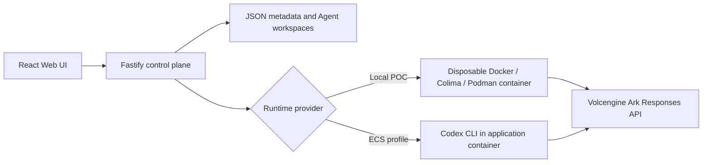

# Volc Agent Launchpad

## Warden — the submission

This fork adds **Warden**, middleware that replaces the Runtime's ambient
provider credential and open internet access with a run-scoped, brokered,
metered and revocable capability.

## Warden at a glance

Warden preserves the starter Agent platform while moving credential and network
authority out of the untrusted Runtime.

<p align="center">
  <a href="docs/WARDEN_ARCHITECTURE.md">
    
  </a>
</p>

The Runtime receives only a temporary `wgt_` grant. The trusted Warden broker
holds the provider credential, enforces destination and budget policy, records
correlated evidence, and can revoke the exact active Run.

See the [complete Warden architecture](docs/WARDEN_ARCHITECTURE.md) and
[three-minute demonstration guide](docs/DEMO.md).

**Judging path — this is the one that runs Warden:**

```bash
ARK_API_KEY=<ark model api key> \
ARK_MODEL=ep-<endpoint id> \
ARK_BASE_URL=https://ark.ap-southeast.bytepluses.com/api/v3 \
npm run poc
```

`ARK_BASE_URL` matters: the starter default points at Volcengine
(`ark.cn-beijing.volces.com`). A **BytePlus** key sent there returns
"The API key doesn't exist". Use the line above for BytePlus accounts.

| Startup path | Warden | Use |
| --- | --- | --- |
| `npm run poc` | **Enabled** | **Official judging and demo path** |
| `npm run dev` | Disabled | Baseline development only |
| `docker compose up` | Disabled | Baseline deployment only |
| ECS | Disabled | Not supported by this Warden POC |

Warden requires `RUNTIME_PROVIDER=container`; the other paths use the
local-process Runtime, which shares the host network and cannot satisfy its
isolation invariant. `WARDEN_ENABLED=auto` (the default) enables it exactly
where it can hold.

Verify it:

```bash
npm run check                                            # unit tests + build
npm run warden:smoke                                     # broker, no Docker needed
WARDEN_DOCKER_TESTS=1 npm run test -w @launchpad/server   # real two-network topology
```

To prove the credential boundary without displaying a secret, start a long
Agent turn and run `npm run warden:secret-proof` in a second terminal. The proof
checks the live broker, Runtime, public grants, traces, Runs and messages and
prints only PASS/FAIL evidence. See the [live-demo guide](docs/DEMO.md).

Warden's implementation, threat model and honest limitations are in
**[docs/WARDEN.md](docs/WARDEN.md)**. Use the reproducible
**[three-minute live demo](docs/DEMO.md)** to prepare and present the project.
The standalone **[one-page Warden architecture](docs/WARDEN_ARCHITECTURE.md)**
labels the trust boundary, enforcement point, evidence path and recovery
control. The sections below describe the unmodified starter kit.

### Credentials and secret safety

Reviewers supply their own ModelArk API key and Responses-compatible endpoint;
the repository intentionally contains neither. A BytePlus key must be paired
with the BytePlus `ARK_BASE_URL` shown above. A Volcengine key must use its
matching regional Volcengine URL instead.

Pass credentials only as environment variables or through an ignored local
`.env` file. Never commit them, paste them into documentation, record the
startup command on screen, or add a real value to `.gitleaks.toml`. The
`secret-scan` CI job checks the complete Git history, while
`npm run warden:secret-proof` verifies the live Runtime boundary without
printing either credential.


A minimal Agent platform for three-day middleware hackathons. It provides Agent
CRUD, a browser Playground, persistent workspaces, and Codex CLI backed by the
Volcengine Ark Responses API.

The starter baseline can run locally with Docker, Colima or rootless Podman, or
deploy to Volcengine ECS. **Docker is the supported and verified Warden judging
path.** Colima and Podman remain best-effort for the broker topology.

> [!WARNING]
> This remains a single-user proof of concept. Warden adds run-scoped delegation,
> brokered egress, revocation and redacted traces on the official `npm run poc`
> path; it does not add production identity, tenant isolation or a hardened
> multi-tenant sandbox. See [SECURITY.md](SECURITY.md).

## Screenshots

### Agent Playground


### Create an Agent


## Features

- React and TypeScript Web UI
- Agent create, edit, start, stop, delete, and multi-turn chat
- Fastify control plane with asynchronous Run state
- Persistent Agent workspaces and Codex sessions
- Disposable Docker, Colima, or Podman container for each local turn
- Docker and Terraform deployment paths for Volcengine ECS
- Warden run grants, destination policy, revocation, budgets and redacted traces

## Requirements

- Node.js 22+
- npm 10+
- Docker for the verified Warden path; Colima or Podman for the starter baseline
- A BytePlus ModelArk API key and endpoint that supports the Responses API

Codex CLI is included in the Runtime image and is not required on the host.

## Local browser SOP

### 1. Check the local tools

Install Node.js 22+ and Docker for the supported Warden judging path, then
verify them:

```bash
node --version
npm --version
docker --version        # Docker Desktop or Docker Engine
```

Codex CLI is already included in the Runtime image.

### 2. Clone the repository

```bash
git clone https://github.com/javierchanj/techjam-agent-middleware.git
cd techjam-agent-middleware
```

Skip this step when already working from the repository root.

### 3. Start the POC

```bash
ARK_API_KEY=your-ark-api-key \
ARK_MODEL=ep-your-endpoint-id \
ARK_BASE_URL=https://ark.ap-southeast.bytepluses.com/api/v3 \
npm run poc
```

The first run installs Node.js dependencies and builds the Runtime image. The
script can select Docker, Colima, or Podman, but Docker is the verified Warden
path. Use the endpoint URL that matches the account which issued the key.

### 4. Open the browser

Visit <http://localhost:3000>, or open it from the terminal:

```bash
open http://localhost:3000       # macOS
xdg-open http://localhost:3000   # Linux desktop
```

In the Web UI:

1. Select **Create Agent**.
2. Enter a name, description, and workspace instructions.
3. Select **Create Agent** again.
4. Enter a task in the Playground, for example:

   ```text
   Create a TypeScript hello-world CLI, add a test, and run it.
   ```

The Agent can write files, run commands, and continue the same Codex session in
later messages.

### 5. Stop and resume

Press `Ctrl+C` in the startup terminal. The script removes temporary Runtime
containers but keeps Agent workspaces and conversations.

- macOS state: `~/.volc-agent-launchpad/`
- Linux state: `.local/`
- Custom location: set `LOCAL_POC_DATA_ROOT`

Run the same `npm run poc` command to continue later.

### Select a specific container engine

Force Podman when multiple engines are installed:

```bash
CONTAINER_ENGINE=podman \
ARK_API_KEY=your-ark-api-key \
ARK_MODEL=ep-your-endpoint-id \
ARK_BASE_URL=https://ark.ap-southeast.bytepluses.com/api/v3 \
npm run poc
```

Colima uses `CONTAINER_ENGINE=docker` because it exposes the Docker CLI.

For a clean Linux host, follow the
[rootless Podman setup](docs/LOCAL_POC.md#rootless-podman-on-linux).

## Docker Compose

Create and edit the configuration:

```bash
./scripts/bootstrap-local.sh
```

Required values in `.env`:

```dotenv
ARK_API_KEY=your-ark-api-key
ARK_MODEL=ep-your-endpoint-id
ARK_BASE_URL=https://ark.ap-southeast.bytepluses.com/api/v3
APP_AUTH_TOKEN=replace-with-at-least-24-random-characters
```

Start the application:

```bash
docker compose up --build
```

Open <http://localhost:3000>. Stop it without deleting Agent data:

```bash
docker compose down
```

## Development

```bash
npm install
cp .env.example .env
npm install --global @openai/codex@0.111.0
npm run dev
```

- Web UI: <http://localhost:5173>
- API: <http://localhost:3000>

Use local paths in `.env` when running outside Docker:

```dotenv
APP_DATA_DIR=.data
AGENT_WORKSPACE_ROOT=workspaces
CODEX_HOME=codex-home
```

## Deployment

- [Existing Linux ECS with Docker](docs/DEPLOYMENT.md#existing-linux-ecs)
- [Complete Volcengine environment with Terraform](docs/DEPLOYMENT.md#terraform-deployment)
- [Local Docker, Colima, and Podman details](docs/LOCAL_POC.md)

The existing-ECS script deploys from the current source tree:

```bash
cp .env.example .env.production
./scripts/deploy-existing-ecs.sh .env.production
```

The Terraform path provisions VPC, subnet, security group, ECS, and EIP:

```bash
cp deploy/volcengine/terraform.tfvars.example \
  deploy/volcengine/terraform.tfvars
./scripts/deploy-volcengine.sh
```

## Configuration

| Variable | Default | Purpose |
| --- | --- | --- |
| `ARK_API_KEY` | Required | Ark model API key. |
| `ARK_MODEL` | Required | Responses-capable endpoint or model ID. |
| `ARK_BASE_URL` | Beijing v3 endpoint | Ark OpenAI-compatible API URL. |
| `APP_AUTH_TOKEN` | Empty on loopback | Shared demo token; use 24+ random characters remotely. |
| `RUNTIME_PROVIDER` | `local-process` | `container` for disposable local Runtime containers. |
| `CODEX_SANDBOX_MODE` | `workspace-write` | Codex inner sandbox mode. |
| `CODEX_TIMEOUT_MS` | `600000` | Maximum duration of one turn. |
| `LOCAL_POC_DATA_ROOT` | Platform-specific | Local metadata, workspace, and session directory. |

See [.env.example](.env.example) for all Runtime and resource-limit options.

## How it works



The first turn uses `codex exec`; later turns resume the stored Codex thread.
Deleting an Agent archives its workspace under `workspaces/.deleted/`.

See [docs/ARCHITECTURE.md](docs/ARCHITECTURE.md) for component and extension
boundaries.

## Validation

```bash
npm run check
npm run warden:smoke
WARDEN_DOCKER_TESTS=1 npm run test -w @launchpad/server
terraform fmt -check -recursive deploy/volcengine
docker compose config
```

## Documentation

- [Warden technical documentation and threat model](docs/WARDEN.md)
- [Three-minute Warden live demo](docs/DEMO.md)
- [One-page Warden architecture](docs/WARDEN_ARCHITECTURE.md)
- [Architecture](docs/ARCHITECTURE.md)
- [Local POC](docs/LOCAL_POC.md)
- [Deployment](docs/DEPLOYMENT.md)
- [Hackathon extension guide](docs/HACKATHON_EXTENSION_GUIDE.md)
- [Security policy](SECURITY.md)
- [Contributing](CONTRIBUTING.md)

## License

[MIT](LICENSE)
