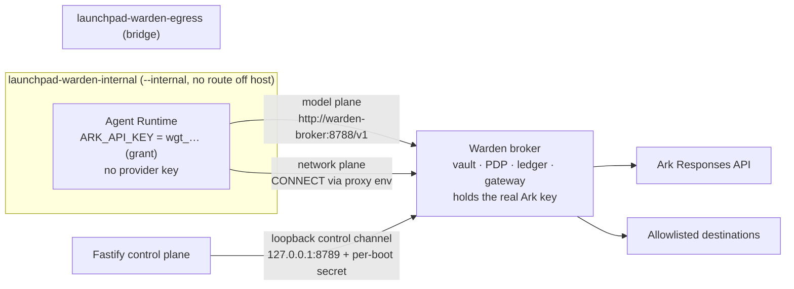

# Warden — a capability-scoped egress broker for Agent Runtimes

## The problem

Two lines in the Starter Kit's `container-codex-runner.ts` decide this:

```ts
"--network", "bridge",        // unrestricted outbound internet
"--env", "ARK_API_KEY",       // the real production key, in the container
```

Every Runtime container running model-authored code holds a long-lived
production credential *and* has open egress. A prompt injection in a file the
Agent reads, a malicious postinstall script, or a plain model mistake is enough
to read the key out of the environment and POST it anywhere. `--cap-drop ALL`,
`no-new-privileges`, CPU and PID limits do not help: the container is behaving
exactly as configured.

Warden replaces ambient credential and network authority with a run-scoped
capability that is brokered, metered, attributable and revocable.

## The invariant

> A Runtime container never holds the provider credential, and has no direct
> route to the Internet. All external access must cross Warden under a live,
> scoped grant.

This is deliberately narrower than "can only reach destinations a grant names".
Two things on a Docker bridge remain reachable and are **out of scope**:

- **Sibling containers on the same internal network.** Docker bridge networks permit container-to-container traffic by design. Disabling it (`enable_icc=false`) would also cut the Runtime off from the broker. The clean fix is a per-run network; that is future work, not a claim being made here.
- **Host services bound to `0.0.0.0`,** via the bridge gateway address. The control plane and the Warden control port both bind loopback specifically so they are *not* among them, but unrelated host services are. Docker's isolated-gateway mode would remove this.

Stating the invariant this way means every word of it is defended by a test.

## Topology

Warden runs as a **dual-homed broker container**. It is the only member of both
networks, so it is the only route out.



Why not a host-gateway listener: an `--internal` network drops traffic leaving
the bridge, but the host's own bridge address is *in-subnet* and stays
reachable. A Runtime that can reach a host-side Warden can therefore also probe
every other host service bound to `0.0.0.0` — including the control plane. Moving
the broker into the topology removes the *need* for that reachability.

Being precise about what this does and does not buy:

- **Internet egress: blocked by the network.** No masquerade, no route. Verified by integration test, not assumed.
- **The control plane: unreachable**, because it binds `127.0.0.1` (the POC script already does this) and the control port is published to loopback only. A container cannot route to the host's loopback.
- **Other host services bound to `0.0.0.0`: still reachable** via the bridge gateway address. This is a property of Docker bridge networking, not something Warden can fix from inside. It is a documented residual risk; a hardened deployment would add an egress firewall rule on the bridge.

The cost of the dual-homed design is that the real key lives in the broker
container rather than the Fastify process. That is the right trade: the
protected boundary is the **untrusted Runtime**, not the process table.

## Two planes, and why the model plane is not proxied

Proxy environment variables cannot perform credential substitution. An HTTPS
request through a forward proxy arrives as `CONNECT` and then becomes an opaque
TLS tunnel — the broker could never rewrite its `Authorization` header.

So the two planes work differently:

| Plane | Mechanism | What Warden can do |
| --- | --- | --- |
| Model | `base_url` override to `http://warden-broker:8788/v1`, plaintext inside the internal network | Full body visibility: inject the real key, meter tokens, redact, allow/deny, restrict the provider path |
| Network | `HTTP_PROXY`/`HTTPS_PROXY` (both cases) → CONNECT allowlist | Host + port, then DNS resolution screened and the connection pinned to the resolved address. Contents stay opaque. |

### Permitted provider surface

A model-plane capability is not the whole provider API. The broker holds a
credential that would authorise file upload, batch jobs and fine-tuning; the
Runtime may reach only the inference surface Codex needs:

```
POST /responses            <- Codex wire_api = "responses"
POST /chat/completions     <- fallback wire protocol
GET  /models               <- capability probe
GET  /models/{id}          <- exactly one id segment, no deeper
```

Matching is exact. Only an entry ending `/{id}` accepts a further segment, so
`POST /responses/anything` is refused. Configure with `WARDEN_MODEL_PATHS`.

Everything else returns `path_not_allowed`.

`NO_PROXY`/`no_proxy` name the broker, so the direct model request is not
recursively sent through the broker as a proxy.

## Grant templates and dry-run checks

Delegation is only useful if an operator can state it in one word and verify it
without running anything.

| Template | Delegates |
| --- | --- |
| `model-only` | Inference endpoint and nothing else |
| `model-plus-github` | Inference plus `github.com`, `api.github.com`, `codeload.github.com` on 443 |
| `no-external-network` | Nothing at all, including inference |

Applying a template changes what the **next** run is delegated. Grants already
issued keep the scopes they were minted with, so a run's authority is stable for
its whole lifetime and cannot be widened underneath it.

There is deliberately no "GitHub read-only" template. Method-level restriction is
impossible on the network plane: an HTTPS request inside a CONNECT tunnel is
opaque to the broker, which can enforce *where* the Agent connects but not *what*
it sends. A template named "read-only" would claim a control that does not exist,
and there is a test asserting no template is ever named that.

Templates are the only way to change delegation. Ad-hoc allow/deny and budget
mutation endpoints were removed: they widened the API surface without adding a
capability the demo or the threat model needs.

`POST /api/warden/policy/check` answers "would this destination be allowed?"
against the live policy without minting a grant, spending budget, or opening a
socket. It runs the same pure decision function as the enforcement path, so the
answer cannot drift from reality. Exposed in the rail as a single input box —
a judge can name any host and get an immediate, honest verdict.

## Fail-closed

When Warden is enabled there is no degraded mode:

- The internal network must exist **and report `Internal=true`** — verified, not assumed. Otherwise startup aborts.
- The broker container must become healthy within 30s. Otherwise startup aborts.
- `beginRun` must succeed, or the run does not start.
- There is no fallback to a routable bridge. A Warden that quietly degrades is a platform advertising containment it is not providing.

`WARDEN_ENABLED` defaults to `auto`: on for `RUNTIME_PROVIDER=container`, off
otherwise. An explicit `WARDEN_ENABLED=true` on the local-process Runtime is a
configuration error and throws, because that Runtime shares the host network and
the invariant cannot hold. `WARDEN_ENABLED=false` restores the exact baseline.

## Extension seams used

| Seam | Change |
| --- | --- |
| `types.ts` | `Principal`, `RuntimeCredentials`; `RunnerRequest` gains `runId`/`traceId`/`actor`/`credentials` |
| `agent-service.ts` | assigns `traceId` at Run creation, before execution; adds `cancelRun` |
| `container-codex-runner.ts` | network placement and per-run credentials from `RunnerRequest` |
| `runner-factory.ts` → `index.ts` | `WardenRunner` decorates the runner the factory returns |
| `app.ts` | actor header → human principal; Warden route plugin |
| `config.ts` | `base_url` override to the broker |
| `apps/web/src/App.tsx` | one `<WardenPanel/>` mount |

## Honest accounting

Claims that are **precise**:

- The real Ark key is absent from the Runtime's environment, arguments and inspection output.
- The grant token *is* visible inside the Runtime and via `docker inspect`. That is acceptable and expected: it is short-lived, scoped, metered, revocable, and only usable from the internal network. It is never rendered in the UI, traces or screenshots — only an 8-character fingerprint is.
- Call-count and wall-clock budgets are **hard**: enforced before work happens, with the call reserved at authorize time so concurrent requests cannot overspend.
- The token budget is **soft**: usage is metered from the response and enforced on the *next* call. It is labelled "soft cap" in the UI. It does not prevent a single oversized response.

Known limitations:

- **TLS is not inspected on the network plane.** Enforcement is host + port. Warden knows *where* the Agent went, not *what* it sent.
- **Other host services bound to `0.0.0.0` remain reachable** from the Runtime via the bridge gateway address, as described above.
- **The interface guard depends on DNS.** The broker refuses to start if it cannot resolve its own alias, because it could not otherwise keep the control API off the Runtime network. `WARDEN_UNSAFE_SKIP_INTERFACE_GUARD=1` exists for running the broker outside a container during development and must never be set in a demo.
- **Model-plane traffic is plaintext** inside the internal network. Acceptable because that network has no route off the host; it would not be on a shared host.
- **Grants are in-process.** They do not survive a broker restart, which is fine: they are short-lived by design. The broker ledger is a bounded in-memory ring, but the control plane appends each finished trace to a redacted JSONL archive, so stored Runs still resolve their evidence after a restart.
- **The provider key is moved, not eliminated.** It lives in the broker container instead of the Runtime. Anyone who can run `docker inspect` on the broker, or exec into it, can read it. Warden shrinks the blast radius from "every Agent Runtime" to "one trusted container"; it is not a secrets manager.
- **Warden is destination control, not DLP.** Once a destination is allowlisted, the Agent can send it arbitrary encrypted data. Warden constrains *where* data can go, never *what* goes there.
- **Mock identity.** `x-launchpad-actor` stands in for a session. The point is that authorization is server-side, not that the login is real.
- **Docker is the supported path.** Podman and Colima are untested for the broker topology. ECS deployment is optional under the brief and is not supported by this Warden POC; the baseline ECS path still works with `WARDEN_ENABLED=false`.

## Threat model

| Threat | Control | Evidence |
| --- | --- | --- |
| Credential theft from the Runtime | Provider key never enters the Runtime; grant is run-scoped and closes on completion | `warden-runner.test.ts` |
| Exfiltration after prompt injection | Internal network + CONNECT allowlist; denied before a socket opens | `gateway.test.ts` |
| Broker used to reach sibling containers or metadata | Loopback/private/link-local literals refused unless named explicitly | `policy.test.ts` |
| `allowed.com@evil.com` authority tricks | User-info authorities rejected outright | `policy.test.ts` |
| Confused deputy / no attribution | Human + agent principal on every grant and span | `warden-runner.test.ts` |
| Runaway cost | Hard call and wall-clock budgets; reservation at authorize time | `grants.test.ts` |
| Compromised long-running Agent | Revoke-and-cancel: authority dies and the container is stopped | `gateway.test.ts`, `routes` |
| Secrets in traces or errors | Redaction at ledger write and on the error path | `redact.test.ts` |
| Silent loss of enforcement | Fail-closed startup; internal flag verified | `broker-container.ts` |
| Provider API abuse beyond inference | Path + method allowlist on the model plane | `gateway.test.ts` |
| DNS rebinding to a private address | Resolve, screen the resolved address, pin the connection to it | `gateway.ts` |
| Control API reachable from the Runtime | Broker resolves its own internal address and refuses to serve control on that interface | `control-server.ts` |
| Exfiltration continuing after revocation | Revocation tears down live tunnels and in-flight streams | `control.ts`, `gateway.ts` |
| Runtime bypassing the network boundary | Real container on a real `--internal` network cannot reach 1.1.1.1:443 | `isolation.integration.test.ts` |

## Three-minute demo

Uses `demo/exfil-demo.js` rather than depending on the model deciding to obey a
malicious file, so the abuse case is deterministic. The Agent still invokes it
through the real Playground, and Warden blocks the real network action.

| Time | Action | What the judges see |
| --- | --- | --- |
| 0:00–0:25 | Show the two starter-kit lines; state the invariant | The flaw is concrete and pre-existing, not invented for the demo. |
| 0:25–1:10 | Normal coding task through the Playground | Real Codex run succeeds through a run grant. Trace fills in live. |
| 1:10–1:25 | Open the grant card; ask a judge to name any host and type it into the check box | Credential type: run grant. Fingerprint `91f3…`. Provider key in Runtime: no. Their host comes back `host_not_allowed` without anything being run. |
| 1:25–2:10 | Ask the Agent to run `exfil-demo.js` | It prints the credential *type* and fingerprint (never a value), probes both layers, and reports `blocked by the network` then `denied by Warden policy: host_not_allowed`. The rail shows a matching red span. |

> Start the demo with one benign destination allowlisted, e.g.
> `WARDEN_ALLOWED_NETWORK_HOSTS=api.github.com:443`. This shows the allowlist is
> a real allowlist rather than a blanket block, and makes the denial read
> `host_not_allowed` instead of the coarser `plane_not_allowed` you get when a
> grant holds no network capability at all.
| 2:10–2:40 | Start a longer run, click **Revoke access** | Grant revoked *and* container cancelled. Agent returns to idle. Trace shows exactly where it stopped. |
| 2:40–3:00 | `npm run check`, architecture diagram, limitations slide | All green; limitations stated openly. |

Deliberately **not** in the demo: live budget editing, and token-exhaustion,
which depends on the provider's streaming usage format. Token metering stays
visible in the rail; it is not the thing being proven on stage.

## Configuration

| Variable | Default | Purpose |
| --- | --- | --- |
| `WARDEN_ENABLED` | `auto` | `auto` = on for the container Runtime. `false` restores the baseline. |
| `WARDEN_PORT` | `8788` | Gateway port on the internal network |
| `WARDEN_CONTROL_PORT` | `8789` | Control channel, published to 127.0.0.1 only |
| `WARDEN_BROKER_HOST` | `warden-broker` | Broker DNS alias on the internal network |
| `WARDEN_INTERNAL_NETWORK` | `launchpad-warden-internal` | Isolated Runtime network |
| `WARDEN_EGRESS_NETWORK` | `launchpad-warden-egress` | Broker-only egress network |
| `WARDEN_MAX_MODEL_CALLS` | `40` | Hard per-run call budget |
| `WARDEN_MAX_TOTAL_TOKENS` | `120000` | Soft per-run token budget |
| `WARDEN_MAX_WALL_CLOCK_MS` | `600000` | Hard per-run wall-clock budget |
| `WARDEN_ALLOWED_NETWORK_HOSTS` | *(empty)* | Exact `host:port` entries. Empty = deny all. |
| `WARDEN_MODEL_PATHS` | `POST /responses,POST /chat/completions,GET /models,GET /models/{id}` | Permitted provider surface |

## Running the live-topology test

```bash
npm run build -w @launchpad/server        # the broker ships as compiled dist
WARDEN_DOCKER_TESTS=1 npm run test -w @launchpad/server
```

Skipped by default so `npm run check` stays green without a container engine.
It boots the real two-network topology, the real broker container and a fake Ark
upstream, then drives everything from a container placed on the internal network
exactly as a Runtime is. It proves, in order:

1. the broker becomes healthy on the real topology;
2. the Runtime environment holds `wgt_…` and not the provider key;
3. + 4. a real Runtime model call succeeds and the fake Ark receives the substituted real key;
4b. the Runtime cannot reach `1.1.1.1:443` directly — tested by address, so it exercises routing rather than DNS;
5. a forged grant gets `no_grant`;
6. a disallowed CONNECT gets `host_not_allowed` and lands in the trace;
7. `/v1/files` gets `path_not_allowed`;
8. `warden-broker:8789` is unreachable from the Runtime — tested against the broker's alias, not the Runtime's own loopback;
9. revocation tears down an already-open tunnel;
10. revoking a stale grant does not disturb a newer run.