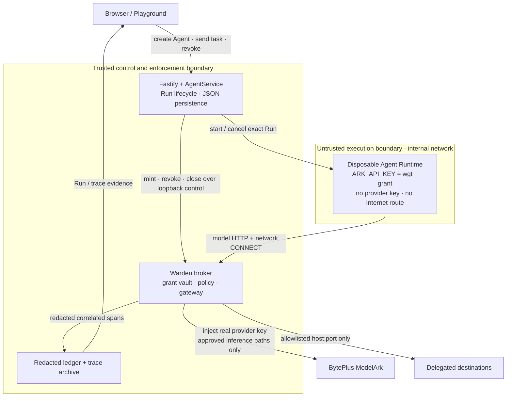

# Warden one-page architecture

## Security objective

> An Agent Runtime never holds the ModelArk provider credential and has no
> direct route to the Internet. External access must cross Warden under a live,
> scoped, metered and revocable run grant.

| Concern | Boundary and mechanism | Evidence |
| --- | --- | --- |
| Credential isolation | The trusted broker holds the provider key. Each untrusted Runtime receives only a hashed-at-rest, short-lived `wgt_` grant. | `warden:secret-proof`, `warden-runner.test.ts`, Docker tests 2–4 |
| Network enforcement | Runtime is attached to a Docker `--internal` network. Its only external path is the dual-homed broker, which applies exact host/port policy and screens resolved addresses. | `exfil-demo.js`, `gateway.test.ts`, Docker tests 4b and 6 |
| Provider restriction | Model traffic terminates at the broker, which substitutes the provider key only for approved inference methods and paths. | `gateway.test.ts`, Docker tests 3–4 and 7 |
| Instrumentation | `AgentService` creates `runId` and `traceId` before execution. Grant, model, network, policy and lifecycle spans share those identifiers and are redacted before persistence. | Warden rail, trace archive, `trace-archive.test.ts` |
| Recovery | Revocation closes live broker streams and cancels only the Runtime whose current `runId` matches the grant. Normal completion closes the grant automatically. | Revoke button, Docker tests 9–10 |

## Trust assumptions and limitations

- Fastify, the Warden broker and the local container-engine administrator are
  trusted; model-authored Runtime code is not.
- HTTPS contents on the generic network plane are opaque. Warden constrains the
  destination, not the encrypted payload.
- Runtimes share an internal bridge in this POC; per-run networks and host
  firewall rules are recommended for multi-tenant hardening.
- The model hop inside the private internal network is plaintext HTTP.
- Docker is the supported and verified judging topology. ECS runs the baseline
  with Warden disabled; Colima and Podman are unverified for Warden.

See [WARDEN.md](WARDEN.md) for rationale, threat model, tests and the complete
limitations list. See [DEMO.md](DEMO.md) for preparation, exact prompts,
expected evidence and the three-minute presentation script.
